# Documentazione
_autore: Karam El labadie_
_data: 2025-09-20_

---

## Architettura di sistema

### Overview
L’architettura è composta da quattro blocchi principali:

1. **Frontend Angular**: interfaccia per clienti, compagnie e amministratori.
2. **Backend Node/Express**: API REST che gestisce la logica applicativa.
3. **Database MongoDB**: archivio persistente dei dati relativi a utenti, voli, rotte, prenotazioni.
4. **Docker Compose**: orchestrazione dei servizi, con healthcheck e seed dei dati iniziali.

Ogni ruolo accede al sistema tramite un flusso differente, ma l’autenticazione centralizzata (JWT) permette una gestione coerente della sicurezza.

### Flusso tipico
1. L’utente interagisce con l’interfaccia Angular.
2. Angular chiama il backend tramite REST (con token JWT allegato quando necessario).
3. Il backend applica logiche di autorizzazione e interroga MongoDB.
4. Il risultato è ritornato al frontend per essere presentato all’utente.

---

## Avvio e deployment

- L’applicazione si avvia con `docker-compose up`.
- MongoDB viene configurato come replica set (`rs0`) tramite il servizio `mongo-setup`.
- Il backend viene inizializzato con un seed: utenti predefiniti (admin, airline, client) e aeroporti di base.
- Il frontend viene esposto sulla porta 80.

---

## Scelte progettuali
| Decisione                                         | Motivazione                                                                                                                                                                                                 |
| ------------------------------------------------- | ---------------------------------------------------------------------------------------------------------------------------------------------------------------------------------------------------------------------------- |
| **Passeggeri embedded in Booking**                | Join-less: tutto il viaggio è un unico documento → letture atomiche, niente \$lookup, niente inconsistente stato passeggeri. Migliora performance e semplifica rollback in caso di fallimento di pagamento (singola delete). |
| **FlightSeat collection dedicata**                | Posti cambiano stato continuamente (available → reserved → occupied). Collection separata evita lock sulla prenotazione e permette update atomici con sessioni Mongo.                                                        |
| **JWT in cookie httpOnly**                        | Token non accessibile da JS → riduce superficie XSS. Logout server-side immediato (cookie clear). Nessun localStorage = niente token leak su reload.                                                                         |
| **catalogo Extra e FlightExtra price**             | Catalogo condiviso (name, category) ma prezzo variabile per volo → flessibile senza duplicare descrizioni. Aggiornamento prezzi in bulk con un solo update.                                                                 |
| **MongoDB Replica Set**                           | HA su singolo nodo di sviluppo ma pronto per scale-out; letture secondarie per /search → scarico primario. Rollback automatico in caso di abort di transazione.                                                              |
| **State booking in localStorage**                 | Permette di chiudere il browser e riprendere il checkout; dati non sensibili (token escluso). Svuotato al completamento o alla partenza del volo.                                                                            |
| **Soft-delete su Flight / Booking**               | Annullamento logico (status = CANCELLED) mantiene audit trail e statistiche.|
| **Reservation expiry 15 min**                     | Posti bloccati per 15 minuti dalla conferma della selezione; cleanup automatico ogni minuto → niente posti bloccati per sempre se utente abbandona il checkout.                                                                                        |


## Modello dati

Il database MongoDB contiene collezioni:

| Collezione              | Descrizione breve                             | Campi chiave (esempio)                                         |
| ----------------------- | --------------------------------------------- | -------------------------------------------------------------- |
| `airports`              | Aeroporti                              | `{iata, name, city, country}`                                  |
| `users` (discriminator) | Client / Airline / Admin                      | `{email, passwordHash, role, ...fieldsSpecifici}`              |
| `planes`                | Aerei di una compagnia                        | `{tail, airline, seatConfiguration}`                           |
| `seats`                 | Posti generati automaticamente per ogni aereo | `{plane, row, column, class}`                                  |
| `routes`                | Coppie origine-destinazione di una compagnia  | `{airline, origin, destination}`                               |
| `flights`               | Volo schedulato con prezzi                    | `{flightNo, dep, arr, prices, route, status}`                  |
| `flightseats`           | Stato di ogni posto per ogni volo             | `{flight, seat, status, reservedBy, reservationExpiry}`        |
| `extras`                | Catalogo servizi opzionali                    | `{name, category, description, perPassenger}`                  |
| `flightextras`          | Prezzo di un extra su un volo specifico       | `{extra, flight, price}`                                       |
| `bookings`              | Prenotazione confermata                       | `{user, itinerary, passengers[], totalPrice, payment, status}` |


Seguono esempi di documenti:
1) airports
```JSON
{
  "_id": ObjectId("6677e9a1b1c2d3e4f5a6b7c8"),
  "iata": "MXP",
  "name": "Milan Malpensa",
  "city": "Milan",
  "country": "IT"
}
```

2) users (schema discriminator → Client, Airline, Admin)
```JSON
/* Client */
{
  "_id": ObjectId("6677e9b2c3d4e5f6a7b8c9d0"),
  "email": "mario.rossi@uni.it",
  "passwordHash": "$2b$10$...",
  "role": "Client",
  "firstName": "Mario",
  "lastName": "Rossi",
  "dateOfBirth": ISODate("1998-05-14T00:00:00Z"),
  "createdAt": ISODate("2024-06-20T10:30:00Z"),
  "updatedAt": ISODate("2024-06-20T10:30:00Z")
}

/* Airline */
{
  "_id": ObjectId("6677e9c3d4e5f6a7b8c9d0e1"),
  "email": "ops@skywings.com",
  "passwordHash": "$2b$10$...",
  "role": "Airline",
  "companyName": "SkyWings",
  "iata": "SW",
  "mustChangePassword": false,
  "createdAt": ISODate("2024-06-01T08:00:00Z"),
  "updatedAt": ISODate("2024-06-01T08:00:00Z")
}

/* Admin */
{
  "_id": ObjectId("6677e9d4e5f6a7b8c9d0e1f2"),
  "email": "admin@flights.com",
  "passwordHash": "$2b$10$...",
  "role": "Admin",
  "createdAt": ISODate("2024-01-01T00:00:00Z"),
  "updatedAt": ISODate("2024-01-01T00:00:00Z")
}
```

3) planes
```JSON
{
  "_id": ObjectId("6677e9e5f6a7b8c9d0e1f2a3"),
  "airline": ObjectId("6677e9c3d4e5f6a7b8c9d0e1"),
  "tail": "EI-SKY",
  "seats": 180,
  "seatConfiguration": {
    "firstRows": 2,
    "businessRows": 5,
    "economyRows": 23,
    "seatsPerRow": 6
  }
}
```

4) seats (auto-generati dal post-save di Plane)
```JSON
{
  "_id": ObjectId("6677e9f6a7b8c9d0e1f2a3b4"),
  "plane": ObjectId("6677e9e5f6a7b8c9d0e1f2a3"),
  "row": 1,
  "column": "A",
  "class": "first"
}
```

5) routes
```JSON
{
  "_id": ObjectId("6677ea07b8c9d0e1f2a3b4c5"),
  "airline": ObjectId("6677e9c3d4e5f6a7b8c9d0e1"),
  "origin": ObjectId("6677e9a1b1c2d3e4f5a6b7c8"),
  "destination": ObjectId("6677ea18c9d0e1f2a3b4c5d6"),
  "createdAt": ISODate("2024-06-02T09:00:00Z")
}
```

6) flights
```JSON
{
  "_id": ObjectId("6677ea29d0e1f2a3b4c5d6e7"),
  "airline": ObjectId("6677e9c3d4e5f6a7b8c9d0e1"),
  "plane": ObjectId("6677e9e5f6a7b8c9d0e1f2a3"),
  "flightNo": "EI-SKY-2A9F",
  "dep": ISODate("2025-07-01T08:00:00Z"),
  "arr": ISODate("2025-07-01T10:30:00Z"),
  "prices": {
    "economy": 89,
    "business": 199,
    "first": 349
  },
  "route": ObjectId("6677ea07b8c9d0e1f2a3b4c5"),
  "status": "ACTIVE"
}
```

7) flightseats (post-save Flight)
```JSON
{
  "_id": ObjectId("6677ea3af2a3b4c5d6e7f8a9"),
  "flight": ObjectId("6677ea29d0e1f2a3b4c5d6e7"),
  "seat": ObjectId("6677e9f6a7b8c9d0e1f2a3b4"),
  "status": "available",
  "reservedBy": null,
  "reservationExpiry": null
}
```

8) extras
```JSON
{
  "_id": ObjectId("6677ea4bf2a3b4c5d6e7f8a9b0"),
  "name": "Extra Bag 23 kg",
  "category": "luggage",
  "description": "Additional checked baggage up to 23 kg",
  "perPassenger": true
}
```

9) flightextras
```JSON
{
  "_id": ObjectId("6677ea5cf2a3b4c5d6e7f8a9b0c1"),
  "extra": ObjectId("6677ea4bf2a3b4c5d6e7f8a9b0"),
  "flight": ObjectId("6677ea29d0e1f2a3b4c5d6e7"),
  "price": 25
}
```

10) bookings
```JSON
{
  "_id": ObjectId("6677ea6df2a3b4c5d6e7f8a9b0c1d2"),
  "user": ObjectId("6677e9b2c3d4e5f6a7b8c9d0"),
  "itinerary": [
    ObjectId("6677ea29d0e1f2a3b4c5d6e7")
  ],
  "passengers": [
    {
      "type": "adult",
      "title": "Mr",
      "firstName": "Mario",
      "lastName": "Rossi",
      "dateOfBirth": ISODate("1998-05-14T00:00:00Z"),
      "nationality": "IT",
      "passportNumber": "AA123456",
      "passportExpiry": ISODate("2028-05-14T00:00:00Z"),
      "email": "mario.rossi@uni.it",
      "phone": "+39 333 123 4567",
      "seatAssignments": [
        {
          "flight": ObjectId("6677ea29d0e1f2a3b4c5d6e7"),
          "seat": ObjectId("6677ea3af2a3b4c5d6e7f8a9")
        }
      ],
      "extras": [
        {
          "flight": ObjectId("6677ea29d0e1f2a3b4c5d6e7"),
          "extra": ObjectId("6677ea4bf2a3b4c5d6e7f8a9b0"),
          "quantity": 1
        }
      ]
    }
  ],
  "totalPrice": 114,
  "payment": {
    "cardHolder": "Mario Rossi",
    "cardLast4": "1234",
    "transactionId": "pi_1234567890"
  },
  "status": "CONFIRMED",
  "createdAt": ISODate("2024-06-20T14:30:00Z")
}
```


---

## API REST

Le API sono organizzate per aree funzionali:
- **Auth**: login, registrazione, gestione profilo.
- **Client**: ricerca voli, prenotazione, visualizzazione delle proprie prenotazioni.
- **Airline**: gestione di rotte, aerei, voli e statistiche.
- **Admin**: gestione utenti e compagnie aeree.

| Percorso                                | Metodo | Autenticazione | Descrizione breve                          | Parametri / Body d'esempio                                                                                                                |
| --------------------------------------- | ------ | -------------- | ------------------------------------------ | ----------------------------------------------------------------------------------------------------------------------------------------- |
| `/api/auth/register`                    | POST   | Nessuna        | Registrazione autonoma client              | `{email, password, firstName, lastName}`                                                                                                  |
| `/api/auth/login`                       | POST   | Nessuna        | Login qualsiasi ruolo                      | `{email, password, role}`                                                                                                                 |
| `/api/auth/logout`                      | POST   | Nessuna        | Logout (svuota cookie)                     | —                                                                                                                                         |
| `/api/auth/user`                        | GET    | Utente loggato | Dati propri profilo                        | —                                                                                                                                         |
| `/api/airports`                         | GET    | Nessuna        | Elenco aeroporti                           | —                                                                                                                                         |
| `/api/flights/search`                   | GET    | Nessuna        | Cerca voli (diretti/1 scalo)               | `?from=MXP&to=JFK&date=2025-07-01`                                                                                                        |
| `/api/flights/:id`                      | GET    | Nessuna        | Dettaglio singolo volo                     | `id` (URL)                                                                                                                                |
| `/api/flights/seats`                    | GET    | Nessuna        | Mappa posti per voli                       | `?flightIds=60a...,60b...`                                                                                                                |
| `/api/flights/extras`                   | GET    | Nessuna        | Extra disponibili per voli                 | `?flightIds=60a...,60b...` (opz.)                                                                                                         |
| `/api/flights/book`                     | POST   | Cliente        | Prenota volo + passeggeri                  | `{passengers[], payment{cardLast4, cardHolder}, totalPrice, itinerary[], extras[]}`                                                       |
| `/api/flights/:id/seats/reserve`        | POST   | Cliente        | Riserva temporanea posti 15 min            | `seats:[{row:5, column:"A"}]`                                                                                                             |
| `/api/client/profile`                   | GET    | Cliente        | Profilo cliente                            | —                                                                                                                                         |
| `/api/client/profile`                   | PATCH  | Cliente        | Aggiorna dati cliente                      | `{"data":{"firstName":"Maria"}}`                                                                                                          |
| `/api/client/profile`                   | DELETE | Cliente        | Cancella account + prenotazioni            | —                                                                                                                                         |
| `/api/client/bookings`                  | GET    | Cliente        | Mie prenotazioni                           | —                                                                                                                                         |
| `/api/client/bookings/:id`              | DELETE | Cliente        | Annulla mia prenotazione                   | `id` (URL)                                                                                                                                |
| `/api/airline/change-password`          | POST   | Compagnia      | Cambio pwd obbligatorio primo accesso      | `{"newPassword":"NuovaPass123!"}`                                                                                                         |
| `/api/airline/planes`                   | GET    | Compagnia      | Aerei di proprietà                         | —                                                                                                                                         |
| `/api/airline/planes`                   | POST   | Compagnia      | Registra nuovo aereo                       | `{"tail":"EI-DEF", "seatConfiguration":{...}}`                                                                                            |
| `/api/airline/planes/:id`               | DELETE | Compagnia      | Elimina aereo                              | `id` (URL)                                                                                                                                |
| `/api/airline/routes`                   | GET    | Compagnia      | Rotte create dalla compagnia               | —                                                                                                                                         |
| `/api/airline/route`                    | POST   | Compagnia      | Crea nuova rotta                           | `{"originId":"60a...", "destinationId":"60b..."}`                                                                                         |
| `/api/airline/route/:id`                | DELETE | Compagnia      | Cancella rotta                             | `id` (URL)                                                                                                                                |
| `/api/airline/flights`                  | GET    | Compagnia      | Voli operati dalla compagnia               | —                                                                                                                                         |
| `/api/airline/flights`                  | POST   | Compagnia      | Inserisci nuovo volo                       | `{"planeTail":"EI-ABC", "routeId":"60a...", "dep":"2025-07-01T08:00:00Z", "arr":"10:30:00Z", "economy":100, "business":200, "first":400}` |
| `/api/airline/flights/:id`              | PATCH  | Compagnia      | Aggiorna solo prezzi                       | `{"newPrices":{"economy":110, "business":220, "first":440}}`                                                                              |
| `/api/airline/flights/:id`              | DELETE | Compagnia      | Annulla volo (soft-delete)                 | `id` (URL)                                                                                                                                |
| `/api/airline/statistics`               | GET    | Compagnia      | Statistiche vendite & passeggeri           | —                                                                                                                                         |
| `/api/admin/users`                      | GET    | Admin          | Lista utenti (tutti i ruoli)               | —                                                                                                                                         |
| `/api/admin/airlines`                   | GET    | Admin          | Lista compagnie aeree                      | —                                                                                                                                         |
| `/api/admin/create-airline`             | POST   | Admin          | Crea account compagnia                     | `{"email":"wing@mail.com", "companyName":"SkyWings", "iata":"SW"}`                                                                        |
| `/api/admin/user/:id`                   | DELETE | Admin          | Elimina qualsiasi utente                   | `id` (URL)                                                                                                                                |
| `/api/admin/reset-airline-password/:id` | POST   | Admin          | Reset password compagnia                   | `id` (URL)                                                                                                                                |
| `/api/admin/airline/:id/statistics`     | GET    | Admin          | Statistiche di una compagnia (vista admin) | `id` (URL)                                                                                                                                |

---

## Autenticazione e workflow

- Login produce un **JWT** firmato con secret server-side (`HS256`, default libreria `jsonwebtoken v9.0.2`).
- Scadenza token: **4 ore**.
- Middleware:
  - `verifyToken`: verifica token e carica `req.user`.
  - `requireRole(role)`: autorizza in base al ruolo.

### Gestione lato frontend
- Il token viene inviato dal backend come **cookie httpOnly**
- **Logout** = cancellazione del cookie lato server.

---

## Frontend Angular

L’applicazione frontend è una **Single Page Application (SPA)** sviluppata in **Angular 18**, organizzata in pagine (components) e servizi (services).
La gestione della navigazione è basata sul **router Angular**, con protezione degli accessi tramite `RoleGuard`.

### Componenti principali
| Componente | Cartella | Scopo |
|-----------|--------|---------|
| `SearchComponent` | `pages/flight-search/search` | Modulo di ricerca voli e visualizzazione lista risultati |
| `FiltersComponent` | `pages/flight-search/filters` | Filtro voli (prezzo massimo, compagnia aerea, ordinamento) |
| `FlightDetailsComponent` | `pages/flight-search/flight-details` | Dettaglio di un singolo volo |
| `PassengerSelectionComponent` | `pages/booking/passenger-selection` | Inserimento dati passeggeri |
| `SeatSelectionComponent` | `pages/booking/seat-selection` | Scelta posti per ciascun volo |
| `ExtraSelectionComponent` | `pages/booking/extra-selection` | Selezione extra opzionali (bagagli, pasti, ecc.) |
| `PaymentComponent` | `pages/booking/payment` | Inserimento dati pagamento e conferma |
| `ProfileComponent` | `pages/client/profile` | Gestione e modifica del profilo client |
| `BookingsComponent` | `pages/client/bookings` | Lista prenotazioni e cancellazioni |
| `AirlineDashboardComponent` | `pages/airline/dashboard` | Dashboard compagnia aerea (gestione voli, rotte, aerei) |
| `AdminDashboardComponent` | `pages/admin/admin-dashboard` | Dashboard amministratore (gestione utenti e compagnie) |
| `UsersComponent` | `pages/admin/users` | CRUD utenti |
| `AirlinesComponent` | `pages/admin/airlines` | CRUD compagnie aeree |
| `LoginComponent` | `pages/auth/login` | Login multi-ruolo (client, airline, admin) |
| `RegisterComponent` | `pages/auth/register` | Registrazione self-service client |

---

### Servizi principali
| Service | Metodi (signature) | Scopo |
|---------|---------------------|---------|
| `ApiService` | `search(params)` → `Observable<FlightSearchResult[]>`<br>`getSeats(flightIds[])`<br>`getExtras(flightIds[])`<br>`book(payload)` → `Observable<Booking>`<br>`getFlight(id)` → `Observable<Flight>` | Comunicazione con backend per voli, posti, extra, prenotazioni |
| `AuthService` | `login(email, pwd, role)`<br>`register(payload)`<br>`logout()`<br>`getUserData()` → `Observable<Client│Airline>`<br>`getToken()` → `string│null` | Login/logout e gestione utente corrente. **Nota**: il token non è salvato in localStorage ma in un cookie httpOnly |
| `FlightSelectionService` | `setSelected(flight)`<br>`setPassengers(p[])`<br>`setSeats(assignments[])`<br>`setExtras(assignments[])`<br>`calculateDuration(dep, arr)` | Gestione stato temporaneo della ricerca e della prenotazione corrente. **Nota**: i dati vengono salvati in `localStorage` solo per permettere di ripristinare la ricerca/booking se l’utente ricarica la pagina. Nessun dato sensibile (token o credenziali) è salvato |
| `ClientService` | `getProfile()`<br>`updateProfile(data)`<br>`deleteAccount()`<br>`getBookings()`<br>`deleteBooking(id)` | Funzioni area cliente |
| `AirlineService` | `getRoutes()` / `createRoute(o,d)`<br>`getPlanes()` / `createPlane()` / `deletePlane(id)`<br>`getFlights()` / `createFlight(f)` / `cancelFlight(id)`<br>`updateFlightPrice(id, newPrices)`<br>`getStatistics()` | Funzioni area compagnia aerea |
| `AdminService` | `getUsers()` / `getAirlines()`<br>`createAirline(data)`<br>`deleteUser(id)`<br>`getAirlineStatistics(id)` | Funzioni amministratore |

---

### Rotte Angular
Le rotte sono protette da `RoleGuard` e da un redirector iniziale che indirizza ogni utente alla home corretta in base al ruolo.

| Percorso | Component | Guardia / Data |
|------|-----------|---------------|
| `/` | redirect automatico | `RootRedirectService` (client → `/search`, airline → `/dashboard`, admin → `/admin/dashboard`) |
| `/search` | `SearchComponent` | – |
| `/flight/details` | `FlightDetailsComponent` | – |
| `/flight/passengers` | `PassengerSelectionComponent` | `RoleGuard` `{role:'client'}` |
| `/flight/seats` | `SeatSelectionComponent` | `RoleGuard` `{role:'client'}` |
| `/flight/extras` | `ExtraSelectionComponent` | `RoleGuard` `{role:'client'}` |
| `/flight/payment` | `PaymentComponent` | `RoleGuard` `{role:'client'}` |
| `/dashboard` | `AirlineDashboardComponent` | `RoleGuard` `{role:'airline'}` |
| `/admin/dashboard` | `AdminDashboardComponent` | `RoleGuard` `{role:'admin'}` |
| `/admin/dashboard/users` | `UsersComponent` | `RoleGuard` `{role:'admin'}` |
| `/admin/dashboard/airlines` | `AirlinesComponent` | `RoleGuard` `{role:'admin'}` |
| `/profile` | `ProfileComponent` | `RoleGuard` `{role:'client'}` |
| `/bookings` | `BookingsComponent` | `RoleGuard` `{role:'client'}` |
| `/login` | `LoginComponent` | – |
| `/register/client` | `RegisterComponent` | – |

---

### Note di sicurezza frontend
- **State temporaneo**: `FlightSelectionService` utilizza `localStorage` solo per ripristinare dati della prenotazione in corso (voli selezionati, passeggeri, extras).
- **Accesso protetto**: tutte le rotte sensibili hanno guardie di ruolo basate sul JWT lato server.


---

## Workflow principali

### Guest (ricerca volo)
- Inserisce criteri di ricerca.
- Ottiene una lista di voli con prezzi e disponibilità.
- Per completare la prenotazione è obbligatorio registrarsi o loggarsi.
<p align="center">
  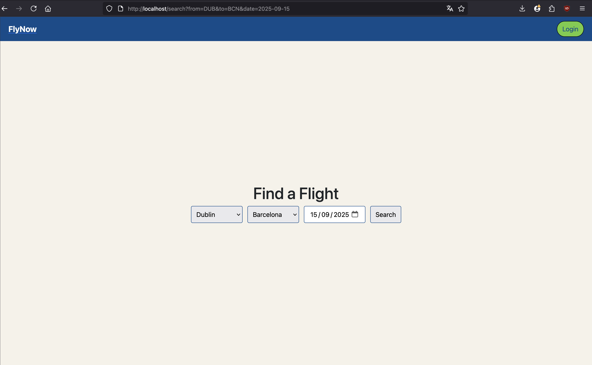
  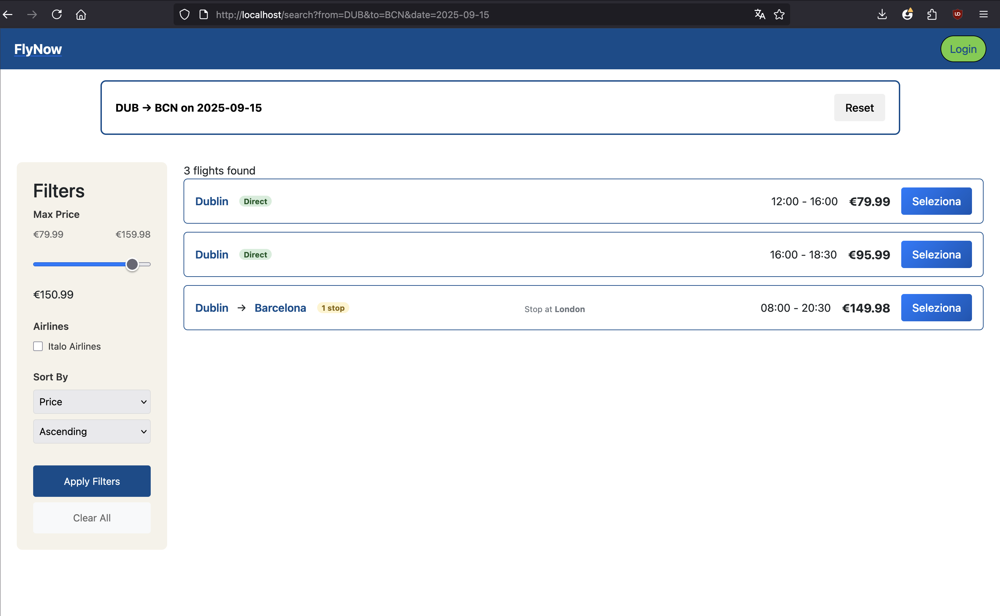
</p>

---

### Client (prenotazione)
1. Login.
2. Selezione del volo e visualizzazione dettagli.
3. Inserimento passeggeri.
4. Scelta dei posti disponibili.
5. Aggiunta di eventuali servizi extra.
6. Inserimento dati pagamento.
7. Vedere le proprie prenotazioni.

<p align="center">
  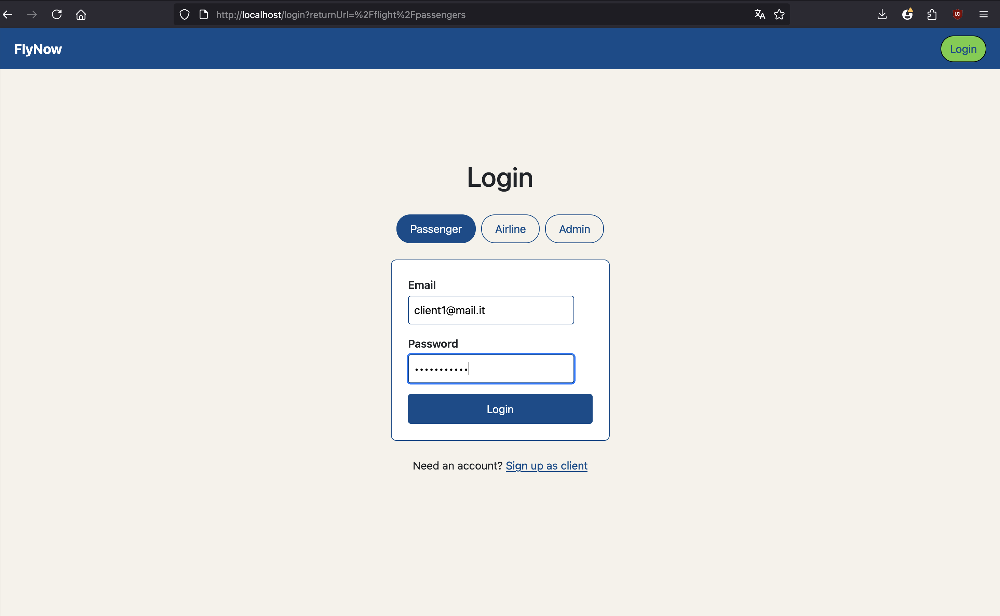
  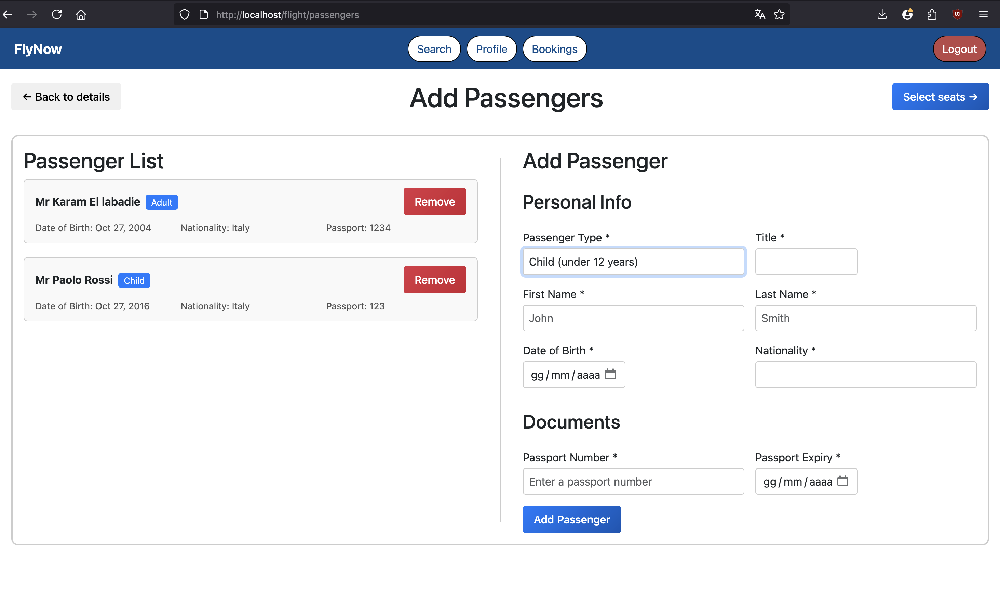
  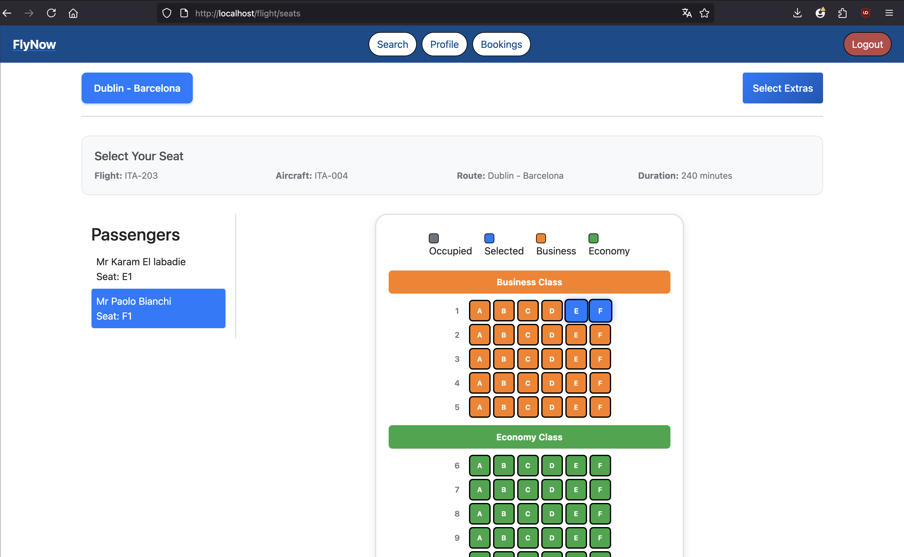
</p>

---

### Airline (gestione)
- Accesso alla dashboard.
- Cambio password, se è il primo accesso
- Creazione e modifica delle rotte.
- Registrazione di aerei e disponibilità.
- Pianificazione e aggiornamento dei voli (solo prezzi).
- Consultazione statistiche sulle prenotazioni e sulle rotte.

<p align="center">
  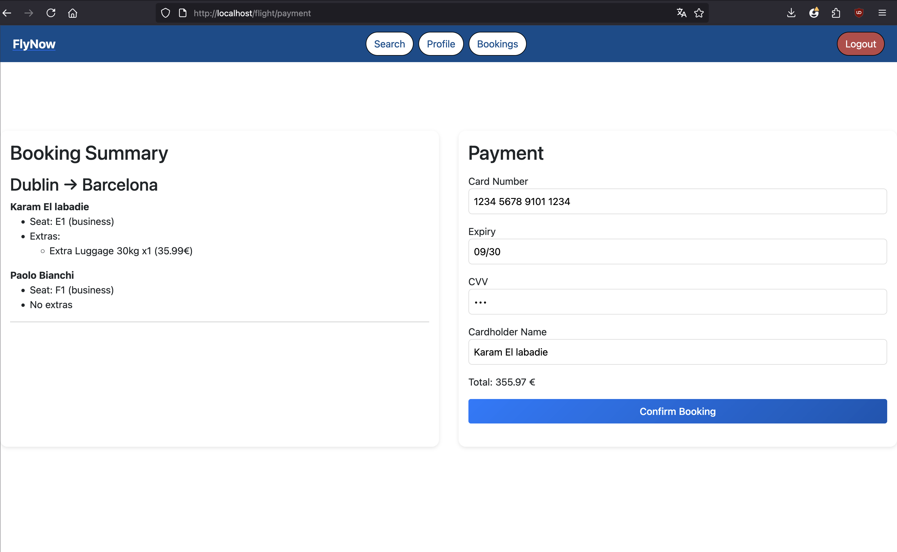
  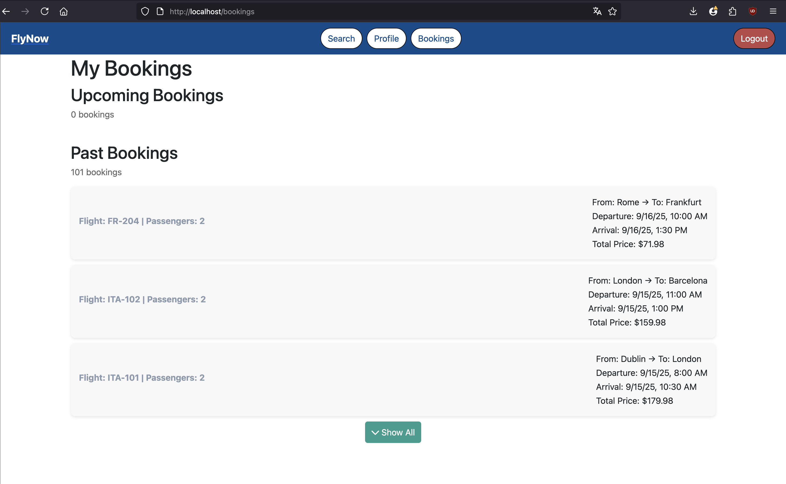
  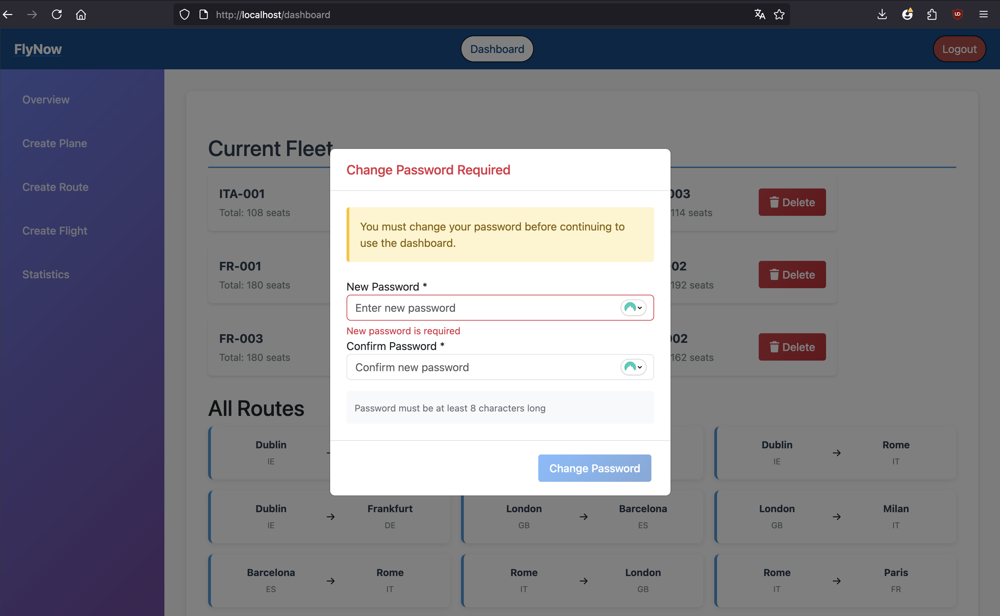
  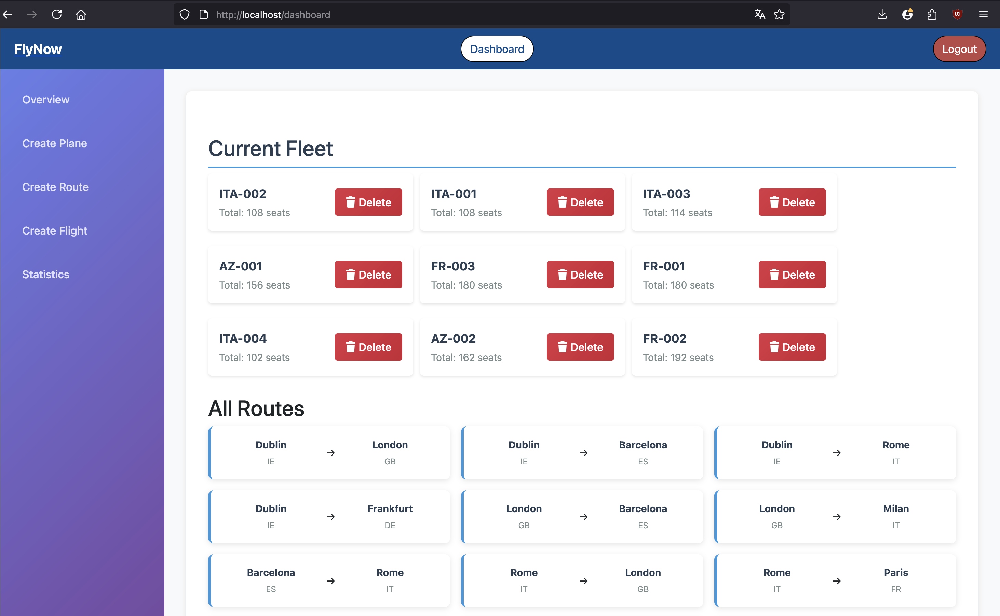
  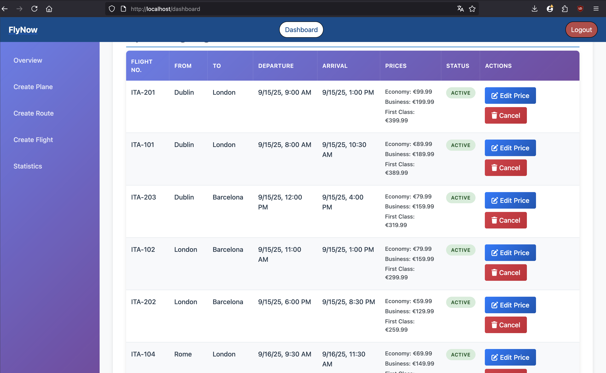
</p>

---

### Admin (gestione sistema)
- Visualizzazione lista utenti.
- Creazione di nuove compagnie aeree.
- Reset password airline.
- Eliminazione di utenti non validi.

<p align="center">
  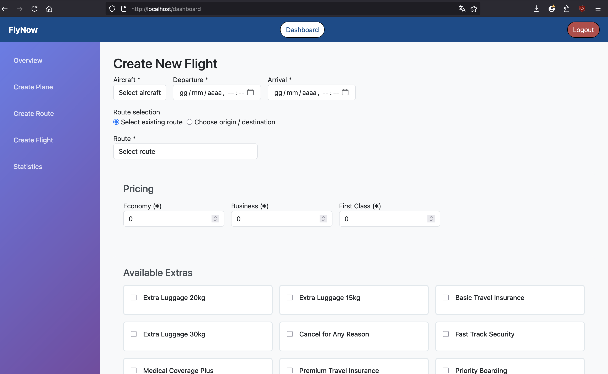
  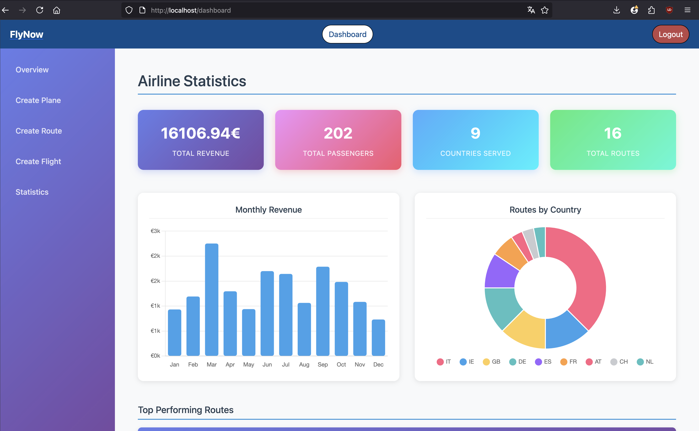
  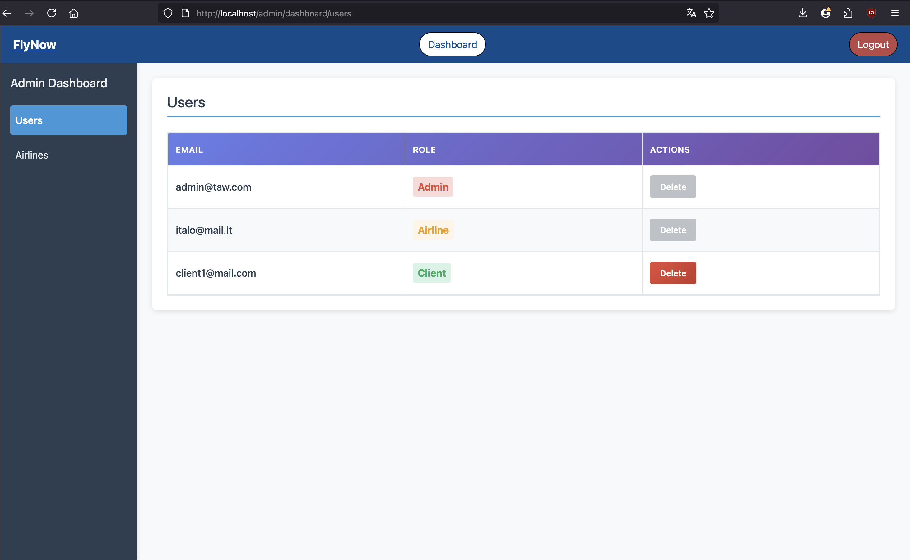
  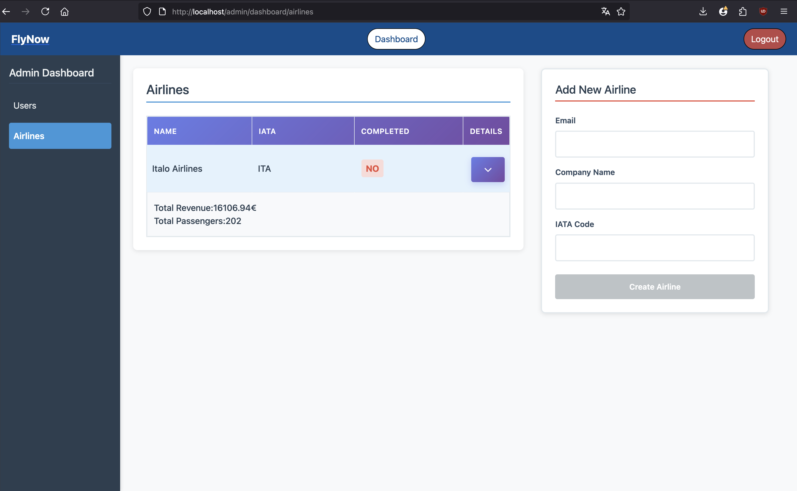
</p>